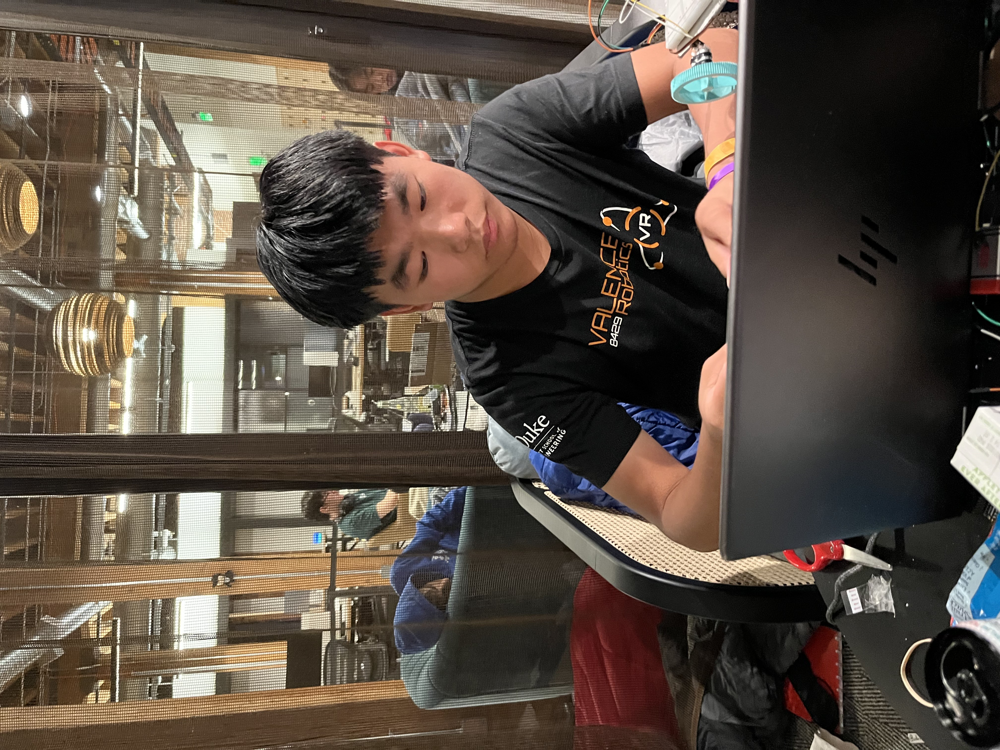
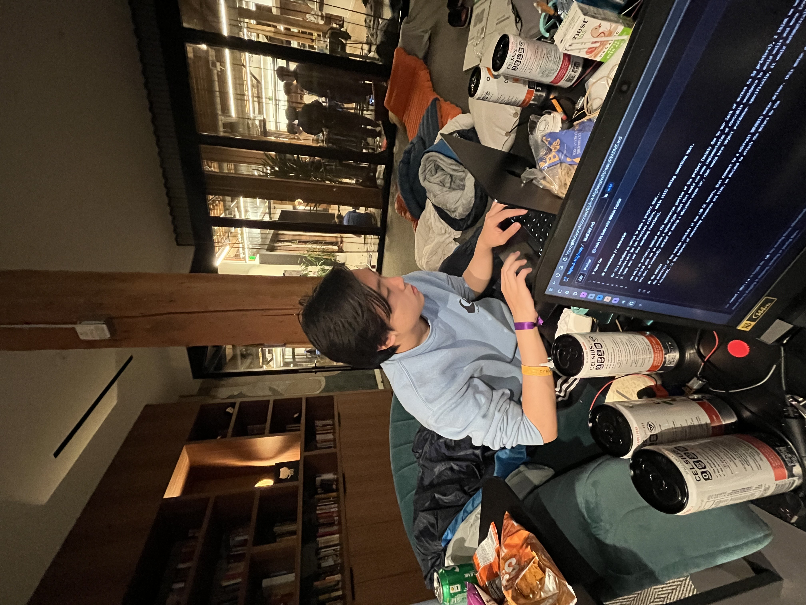

# Waymo Car

## Introduction // Motivation

For this hackathon we wanted to make a project that...
1. Resonated with the San Francisco culture, while still making something that,
2. Looks cool and does something functional.

Now while we seriously fumbled on the apperances portion of the project (mainly due to our lack of access to 3d printers), we believe we were still able to make a project that aligns with our set goals. Our initial goal was to create a sphero-type robot that would use some implementation of obstcable avoidance to avoid walls and move irregularly to ultimately form a complex pong game. However, after much revision, we eventually settled on making a miniature waymo car, that would have object avoidance- specifically, it would automatically steer away from obstacales it would detect using the ultrasonic sensor.

## The Vehicle
The powertrain of the vehicle consists of two n20 DC motors, that connect to a adafruit DRV8833 motor driver. This motor driver allows us to control the motors and gives us some directional control (forward / backwards). In the interest of conserving resources and time, we decided to attach the motors to a pencil for stability and easy connection to the frame. The chassis of vehicle is formed from two large breadboards joined together via zip ties and cardboard cutouts. There is also a small breadboard connected to two ultrasonic sensors at the front of the vehicle to give the vehicle object detection on the left and right sides. The idea was that the algorithm would constantly check whether the left or right side object is closer, and once it reaches a certain threshold, like 10 cm or so, it would turn the opposite way to the sensor with the smallest reading, hence turning away from the object. 

# Schematic
schematic can be found in assets as undercity_car.pdf
